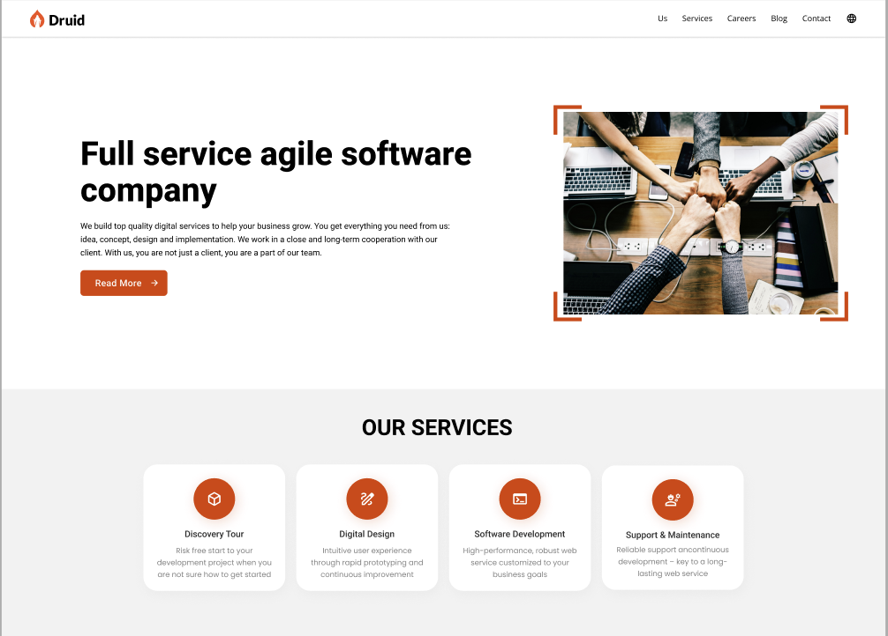

<!-- Improved compatibility of back to top link: See: https://github.com/othneildrew/Best-README-Template/pull/73 -->

<a id="readme-top"></a>

<!-- PROJECT SHIELDS -->
<!--
*** I'm using markdown "reference style" links for readability.
*** Reference links are enclosed in brackets [ ] instead of parentheses ( ).
*** See the bottom of this document for the declaration of the reference variables
*** for contributors-url, forks-url, etc. This is an optional, concise syntax you may use.
*** https://www.markdownguide.org/basic-syntax/#reference-style-links
-->

[![Contributors][contributors-shield]][contributors-url]
[![Forks][forks-shield]][forks-url]
[![Stargazers][stars-shield]][stars-url]
[![Issues][issues-shield]][issues-url]
[![MIT License][license-shield]][license-url]

<!-- PROJECT LOGO -->
<br />
<div align="center">
 <a href="https://github.com/Druid-Project/druid_frontend">
    
</a>


  <h3 align="center">REACT24K TEAM-5</h3>

  <p align="center">
    <br />
    <a href="https://github.com/Druid-Project/druid_frontend"><strong>Explore the docs »</strong></a>
    <br />
    <br />
    <a href="https://github.com/Druid-Project/druid_frontend">View Demo</a>
    ·
    <a href="https://github.com/Druid-Project/druid_frontend/issues/new?labels=bug&template=bug-report---.md">Report Bug</a>
    ·
    <a href="https://github.com/Druid-Project/druid_frontend/issues/new?labels=enhancement&template=feature-request---.md">Request Feature</a>
  </p>
</div>

<!-- TABLE OF CONTENTS -->
<details>
  <summary>Table of Contents</summary>
  <ol>
    <li>
      <a href="#about-the-project">About The Project</a>
      <ul>
        <li><a href="#built-with">Built With</a></li>
      </ul>
    </li>
    <li>
      <a href="#getting-started">Getting Started</a>
      <ul>
        <li><a href="#prerequisites">Prerequisites</a></li>
        <li><a href="#installation">Installation</a></li>
      </ul>
    </li>
    <li><a href="#usage">Usage</a></li>
    <li><a href="#roadmap">Roadmap</a></li>
    <li><a href="#contributing">Contributing</a></li>
    <li><a href="#license">License</a></li>
    <li><a href="#contact">Contact</a></li>
    <li><a href="#acknowledgments">Acknowledgments</a></li>
  </ol>
</details>

<!-- ABOUT THE PROJECT -->

## About The Project

[](https://github.com/Druid-Project/druid_frontend)

Final team project for REACT24K batch of [![Business College Helsinki][BCH]][BCH-url] in collaboration with druid.fi.
This repository contains the frontend code for the new website of **Druid**, developed with **React**, **Redux**, **Material UI (MUI)**, and connected to the **Drupal 10** backend using **JSON API** and **Paragraph modules**. The site is designed to deliver a smooth and modern user experience, showcasing Druid's projects, team, and services.

<p align="right"><a href="#readme-top">back to top^</a></p>

### Built With

This project was built using the following major frameworks and libraries:

- Frontend  
  [![React][React.js]][React-url]
  [![Redux][Redux.js]][Redux-url]
  [![Material UI][MUI.js]][MUI-url]
  [![Axios][Axios.js]][Axios-url]

- Backend  
  [![Drupal][Drupal.org]][Drupal-url]  
  [![Lando][Lando]][Lando-url]

- Automation and marketing  
  [![Mautic][Mautic]][Mautic-url]

- Prject management  
  [![JIRA][JIRA]][JIRA-url]

- Prototyping  
   [![Figma][Figma]][Figma-url]

- Source code  
  [![GitHub][GitHub]][GitHub-url]
- Live hosting  
  [![Vercel][Vercel]][Vercel-url]  
  [![Pantheon][Pantheon]][Pantheon-url]

### Frameworks/Libraries

- **React.js** – JavaScript library for building user interfaces.
- **Redux** – State management library for JavaScript apps.
- **Material UI (MUI)** – React component library that implements Google's Material Design.
- **Axios** – Promise-based HTTP client for making API requests.
- **Drupal 10** – Content management system used for the backend.

<p align="right"><a href="#readme-top">back to top^</a></p>

<!-- GETTING STARTED -->

## Getting Started

Please make sure that you have the environment setup with the below item installed or initialized.

[![Node.js][Node.js]][Node-url]
[![PHP][PHP]][PHP-url]
[![Composer][Composer]][Composer-url]
[![Docker][Docker]][Docker-url]
[![Lando][Lando]][Lando-url]
[![Homebrew][Homebrew]][Homebrew-url]
[![VS Code][VS-Code]][VS-Code-url]
[![Git][Git]][Git-url]
[![Code Editor][Code-Editor]][Code-Editor-url]

### Prerequisites

- **Node.js** (14.17.0 or higher)
- **npm** (6.14.13 or higher)
- **PHP** (8.1.0 or higher)
- **Composer** (2.2.4 or higher)
- **Docker** (20.10.7 or higher)
- **Lando** (3.6.4 or higher)
- **Homebrew** (3.3.16 or higher)
- **VS Code** (1.69.2 or higher)
- **Git** (2.33.1 or higher)

Note: For frontend node environment is required

### Installation

_Below is an example of how you can instruct your audience on installing and setting up your app. This template doesn't rely on any external dependencies or services._

1. Open terminal and your desired folder to start with.
2. Clone the repo
   ```sh
   git clone https://github.com/Druid-Project/druid_frontend.git
   ```
3. Install NPM packages
   ```sh
   npm install
   ```
4. Change git remote url to avoid accidental pushes to base project
   ```sh
   git remote set-url origin github_username/repo_name
   git remote -v # confirm the changes
   ```
5. Start the development server

   ```sh
   npm run dev
   ```

6. Browse to http://localhost:5173/

<p align="right">(<a href="#readme-top">back to top</a>)</p>

<!-- USAGE EXAMPLES -->

<!-- ## Usage -->

<!-- <p align="right">(<a href="#readme-top">back to top</a>)</p> -->

<!-- ROADMAP -->

## Roadmap

- Will be updated soon

<p align="right">(<a href="#readme-top">back to top</a>)</p>

<!-- CONTRIBUTING -->

## Contributing

Team contribution and collaboration instruction can be found [here in jira](https://quanvuong.atlassian.net/wiki/spaces/DWP/pages/262294/Teamwork+and+collaboration)

### Top contributors:

## Contributors

[](https://github.com/Druid-Project/druid_frontend/graphs/contributors)  
<a href="https://github.com/Druid-Project/druid_frontend/graphs/contributors">

</a>

|                                         |                                         |                                     |                                     |
| --------------------------------------- | --------------------------------------- | ----------------------------------- | ----------------------------------- |
| [Kajol](https://github.com/the-sankari) | [Quan](https://github.com/quanvuongday) | [Baty](https://github.com/Betty033) | [Teodor](https://github.com/benteo) |

<p align="right">(<a href="#readme-top">back to top</a>)</p>

<!-- LICENSE -->

## License

Distributed under the MIT License. See `LICENSE` for more information.

<p align="right">(<a href="#readme-top">back to top</a>)</p>

<!-- CONTACT -->

## Contact

[](https://www.linkedin.com/in/kajol-sutra-dhar)  
[](https://github.com/the-sankari)

Project Link: [https://github.com/Druid-Project/druid_frontend](https://github.com/Druid-Project/druid_frontend)

<p align="right">(<a href="#readme-top">back to top</a>)</p>

<!-- ACKNOWLEDGMENTS -->

## Acknowledgments

Use this space to list resources you find helpful and would like to give credit to. I've included a few of my favorites to kick things off!

- [![Business College Helsinki][BCH]][BCH-url]
- [![Druid.fi][Druid]][Druid-url]
- [React](https://reactjs.org/)
- [Material UI](https://mui.com/)
- [React Router](https://reactrouter.com/)
- [Redux](https://redux.js.org/)
- [Redux Toolkit](https://redux-toolkit.js.org/)
- [ESLint](https://eslint.org/)
- [Prettier](https://prettier.io/)
- [GitHub Pages](https://pages.github.com/)
- [Vercel](https://vercel.com/)
- [lando](https://lando.dev/)
- [docker](https://www.docker.com/)
- [node](https://nodejs.org/en/)
- [npm](https://www.npmjs.com/)
- [yarn](https://yarnpkg.com/)
- [git](https://git-scm.com/)
- [github](https://github.com/)
- [github actions](https://github.com/features/actions)
- [mautic](https://mautic.org/)
- [mautic api](https://mautic.org/api/)
- [mautic api documentation](https://mautic.org/api/docs/)

<p align="right">(<a href="#readme-top">back to top</a>)</p>

<!-- MARKDOWN LINKS & IMAGES -->
<!-- https://www.markdownguide.org/basic-syntax/#reference-style-links -->

[contributors-shield]: https://img.shields.io/github/contributors/Druid-Project/druid_frontend.svg?style=for-the-badge
[contributors-url]: https://github.com/Druid-Project/druid_frontend/graphs/contributors
[forks-shield]: https://img.shields.io/github/forks/Druid-Project/druid_frontend.svg?style=for-the-badge
[forks-url]: https://github.com/Druid-Project/druid_frontend/network/members
[stars-shield]: https://img.shields.io/github/stars/Druid-Project/druid_frontend.svg?style=for-the-badge
[stars-url]: https://github.com/Druid-Project/druid_frontend/stargazers
[issues-shield]: https://img.shields.io/github/issues/Druid-Project/druid_frontend.svg?style=for-the-badge
[issues-url]: https://github.com/Druid-Project/druid_frontend/issues
[license-shield]: https://img.shields.io/github/license/Druid-Project/druid_frontend.svg?style=for-the-badge
[license-url]: https://github.com/Druid-Project/druid_frontend/blob/main/LICENSE
[linkedin-shield]: https://img.shields.io/badge/-LinkedIn-black.svg?style=for-the-badge&logo=linkedin&colorB=0A66C2
[linkedin-url]: https://linkedin.com/in/your-linkedin-username
[React.js]: https://img.shields.io/badge/React-61DAFB?style=flat&logo=react&logoColor=black
[React-url]: https://reactjs.org/
[Redux.js]: https://img.shields.io/badge/Redux-764ABC?style=flat&logo=redux&logoColor=white
[Redux-url]: https://redux.js.org/
[MUI.js]: https://img.shields.io/badge/Material%20UI-007FFF?style=flat&logo=material-ui&logoColor=white
[MUI-url]: https://mui.com/
[Axios.js]: https://img.shields.io/badge/Axios-5A29E5?style=flat&logo=axios&logoColor=white
[Axios-url]: https://axios-http.com/
[Drupal.org]: https://img.shields.io/badge/Drupal-0076A8?style=flat&logo=drupal&logoColor=white
[Drupal-url]: https://www.drupal.org/
[Node.js]: https://img.shields.io/badge/Node.js-339933?style=flat&logo=node.js&logoColor=white
[Node-url]: https://nodejs.org/
[PHP]: https://img.shields.io/badge/PHP-777BB4?style=flat&logo=php&logoColor=white
[PHP-url]: https://www.php.net/
[Composer]: https://img.shields.io/badge/Composer-885630?style=flat&logo=composer&logoColor=white
[Composer-url]: https://getcomposer.org/
[Docker]: https://img.shields.io/badge/Docker-2496ED?style=flat&logo=docker&logoColor=white
[Docker-url]: https://www.docker.com/
[Lando]: https://img.shields.io/badge/Lando-3B6CB7?style=flat&logo=lando&logoColor=white
[Lando-url]: https://lando.dev/
[Homebrew]: https://img.shields.io/badge/Homebrew-FBB040?style=flat&logo=homebrew&logoColor=white
[Homebrew-url]: https://brew.sh/
[VS-Code]: https://img.shields.io/badge/VS%20Code-007ACC?style=flat&logo=visual-studio-code&logoColor=white
[VS-Code-url]: https://code.visualstudio.com/
[Git]: https://img.shields.io/badge/Git-F05032?style=flat&logo=git&logoColor=white
[Git-url]: https://git-scm.com/
[Code-Editor]: https://img.shields.io/badge/Code%20Editor-000000?style=flat&logo=code-editor&logoColor=white
[Code-Editor-url]: https://en.wikipedia.org/wiki/Source_code_editor
[JIRA]: https://img.shields.io/badge/JIRA-0052CC?style=flat&logo=jira&logoColor=white
[JIRA-url]: https://www.atlassian.com/software/jira
[Mautic]: https://img.shields.io/badge/Mautic-5528FF?style=flat&logo=mautic&logoColor=white
[Mautic-url]: https://www.mautic.org/
[Figma]: https://img.shields.io/badge/Figma-F24E1E?style=flat&logo=figma&logoColor=white
[Figma-url]: https://www.figma.com/
[BCH]: https://img.shields.io/badge/Business%20College%20Helsinki-0078D4?style=flat&logo=google-classroom&logoColor=white
[BCH-url]: https://www.bc.fi/
[Druid]: https://img.shields.io/badge/Druid.fi-0078D4?style=flat&logoColor=white&labelColor=0078D4
[Druid-url]: https://www.druid.fi/
[GitHub]: https://img.shields.io/badge/GitHub-181717?style=flat&logo=github&logoColor=white
[GitHub-url]: https://github.com/
[Vercel]: https://img.shields.io/badge/Vercel-000000?style=flat&logo=vercel&logoColor=white
[Vercel-url]: https://vercel.com/
[Pantheon]: https://img.shields.io/badge/Pantheon-FFDC28?style=flat&logo=pantheon&logoColor=000000
[Pantheon-url]: https://pantheon.io/
